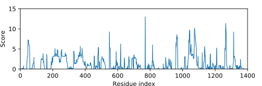

*************************
Choose deletions from MSA
*************************

Once we have an MSA we're happy with, we need to use that MSA to propose 
reasonable deletions.  The purpose of this experiment is to play around with 
different ways of doing this.

Dummy MSA
=========
To have some data to work with, I created a quick MSA by:

- BLAST for 5000 protein sequences similar to Cas9
- Create an MSA for 100 of these sequences, randomly chosen.

This process can be reproduced (although the results will be pseudo-random) 
with the following scripts::

   ./blast_cas9.py
   ./make_dummy_msa.py

Reliability score threshold
===========================
The first part of this idea is to create a "reliability score" for each 
sequence in the alignment.  This score is meant to tell us, "if we see a 
deletion in this alignment, how seriously should we take that?"  A simple  
approach that I saw used in the literature for similar purposes is to calculate 
the percent identity of the alignment to the reference sequence (full-length 
Cas9).  For this calculation, I skipped:

- Terminal gaps: I don't want to penalize sequences that align really well with 
  only a certain domain, e.g. HNH.

- Gaps in the reference sequence: this would give an more and more advantage to 
  sequences very closely related the reference as more and more distant 
  sequences are added to the alignment, creating more and more gaps in the MSA.  
  This works against part of the reason I want a reliability score, which is so 
  that the effect of adding bad sequences to the alignment will tend towards 
  zero (this will allow me to err on the side using more inclusive alignments).

The second part of the idea is to, for each ungapped position in the reference 
sequence, sum the reliability scores for each gap aligned to that position.  In 
other words, the more high quality alignments contain a gap at a certain 
position, the more confident we can be that we can delete that position.

We can see a plot of these sums:

The third and final part of this idea is that we can set a threshold (i.e. a 
vertical line on the above plot) and delete any contiguous stretch of residues 
that score higher than that.  Then, we can sliding this threshold all the way 
from the highest score to the lowest to create a large set of plausible 
deletions.  Deletions that score worse than the average score over the whole 
protein are discarded.  This is not a stringent threshold, but it prevents 
proposing that we should delete the whole protein or small groups of residues 
based purely on bad alignments.

The above scheme is implemented by the following script::

   ./choose_deletions_via_thresholds.py

