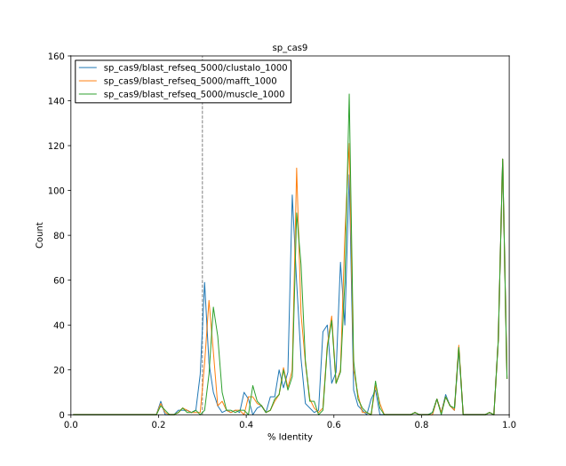

**********************
Compare MSA algorithms
**********************

A wide variety of MSA algorithms have been published.  It's not clear which 
will work the best from simply reading about them, so I tried several.  Since I 
was using the same input sequences for each alignment, it was natural to judge 
the quality of the alignments by the number of sequences with high percent 
identity to the reference.

Results
=======

Runtime
-------
I found that the most important consideration was runtime.  My BLAST search 
returned ~5000 hits for Cas9; only MAFFT, Clustal omega, and MUSCLE could 
handle that number of sequences:

.. datatable:: msa_times.xlsx

   Times are upper limits; I was often running multiple simulations at once 
   with the CPU maxed out.

Percent identity
----------------
MAFFT, Clustal omega, and MUSCLE all perform similarly:

MUSCLE performs the best and Clustal omega performs the worst, but the 
differences are subtle.  I decided to use MAFFT, because it is orders of 
magnitude faster than the other two algorithms.

