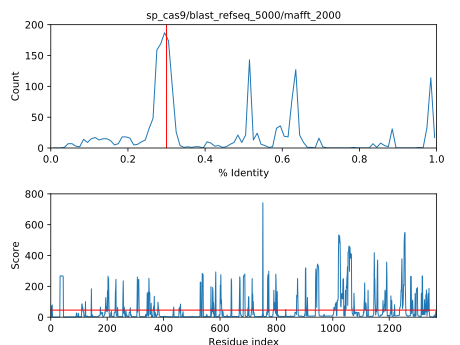
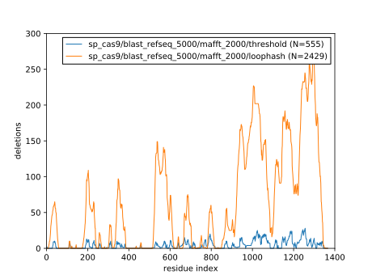

*****************************
Pick deletions via thresholds
*****************************

Once we have an MSA we're happy with, we need to use that MSA to propose 
reasonable deletions.  Here I'm exploring with an algorithm to do this based on 
finding runs of frequently-deleted residues.

Algorithm
=========
The first part of this idea is to create a "reliability score" for each 
sequence in the alignment.  This score is meant to tell us, "if we see a 
deletion in this alignment, how seriously should we take that?"  A simple  
approach that I saw used in the literature for similar purposes is to calculate 
the percent identity of the alignment to the reference sequence (full-length 
Cas9).  For this calculation, I skipped:

- Terminal gaps: I don't want to penalize sequences that align really well with 
  only a certain domain, e.g. HNH.

- Gaps in the reference sequence: this would give more and more advantage to 
  sequences very closely related the reference as more and more distant 
  sequences are added to the alignment, creating more and more gaps in the MSA.  
  This works against part of the reason I want a reliability score, which is so 
  that the effect of adding bad sequences to the alignment will tend towards 
  zero (this will allow me to err on the side using more inclusive alignments).

The second part of the idea is to, for each ungapped position in the reference 
sequence, calculate a "deletion score" that is the sum of the reliability 
scores for each gap aligned to that position.  In other words, the more high 
quality alignments contain a gap at a certain position, the more confident we 
can be that we can delete that position.

We can see a plot of these sums::

   $ minp plot/scores sp_cas9/blast_refseq_5000/mafft_2000
   1999 sequences aligned
   1176 exceed 30% identity
   288/1368 residues (21.1%) have above-average deletion scores.

   (a) Histogram of % identity for the sequences in this MSA.  The red line 
   indicates 30% identity, which is a rule-of-thumb cutoff for homology. (b) 
   Deletion scores.  The red line indicates the average deletion score.

These scores seem to make sense when painted on the structure of Cas9.  Most of 
the high-scoring regions are on the surface and away from the nucleic acids.  
Some of the high scoring regions also match up well with places where a 
deletion wouldn't create a big gap in the 3D structure (data not shown).

:download:`deletion_scores.pse`

In the above PyMol session, blue represents a score of 0 (0th percentile) and 
red represents a score of 22.36 (70th percentile).

.. todo::

   I'd like to have a better strategy for terminal deletions.  The scoring 
   scheme detailed above discourages terminal deletions by not counting 
   terminal gaps.  But terminal deletions are likely to work.

The third and final part of this idea is that we can set a threshold (i.e. a 
vertical line on the lower panel of the above plot) and delete any contiguous 
stretch of residues that score higher than that.  Then, we can slide this 
threshold all the way from the highest score to the lowest to create a large 
set of plausible deletions.  Deletions that score worse than the average score 
over the whole protein are discarded.  This is not a stringent threshold, but 
it prevents proposing that we should delete the whole protein or small groups 
of residues based purely on bad alignments.

30% threshold
-------------
I considered scaling the deletion score weights such that anything with 30% 
identity or below would have 0 weight.  The weight would then increase linearly 
between 30% and 100% identity.  The motivation for doing this is to make the 
score less sensitive to the inclusion of poor alignments.  I'm sure it'd be 
effective, although possible at the expense of excluding true distant homologs.  
I decided not to do this just due to my aversion to having arbitrary 
thresholds, but it might be worth revisiting.

Methods
=======
The above scheme is implemented by the following script::

   $ minp 04/threshold sp_cas9/blast_refseq_5000/mafft_2000

Results
=======
The threshold algorithm chose 555 deletions for Cas9:

Note that the threshold algorithm is relatively conservative, but focuses on 
the same general regions of the structure as the loophash algorithm.  This 
makes sense, since both algorithms use the same deletion scores.

