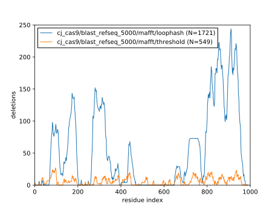

*************************
Pick deletions for cjCas9
*************************

Campylobacter jejuni Cas9 (cjCas9) is one of the shortest natural spCas9 
variants, with only 984 amino acids.  Given that our goal is to create the 
shortest possible Cas9, this may be a better starting point than spCas9.

Methods
=======
::
   
   $ minp 02 cj_cas9
   Found 2120 homologs.
   
::
   
   $ minp 03 cj_cas9/blast_refseq_5000
   SingleLetterAlphabet() alignment with 2120 rows and 992 columns
   MARILAFDIGISSIGWAFSENDELKDCGVRIFTKVENPKTGESL...RKV CjCas9
   MARILAFDIGISSIGWAFSENDELKDCGVRIFTKVENPKTGESL...--- WP_002864485.1
   MARILAFDIGISSIGWAFSENDELKDCGVRIFTKAENPKTGESL...--- WP_052784881.1
   MARILAFDIGISSIGWAFSENDELKDCGVRIFTKAENPKTGESL...--- WP_060810143.1
   MARILAFDIGISSIGWAFSENDELKDCGVRIFTKVENPKTGESL...--- WP_002851159.1
   MARILAFDIGISSIGWAFSENDELKDCGVRIFTKVENPKTGESL...--- WP_052789514.1
   MARILAFDIGISSIGWAFSENDELKDCGVRIFTKVENPKTGESL...--- WP_126418076.1
   MARILAFDIGISSIGWAFSENDELKDCGVRIFTKAENPKTGESL...--- WP_052796772.1
   MVRILAFDIGISSIGWAFSENDELKDCGVRIFTKVENPKTGESL...--- WP_002858341.1
   MARILAFDIGISSIGWAFSENDELKDCGVRIFTKVENPKTGESL...--- WP_100616538.1
   MARILAFDIGISSIGWAFSENDELKDCGVRIFTKVENPKTGESL...--- WP_002896084.1
   MARILAFDIGISSIGWAFSENDELKDCGVRIFTKAENPKTGESL...--- WP_052799962.1
   MARILAFDIGISSIGWAFSENDELKDCGVRIFTKVENPKTGESL...--- WP_052834735.1
   MARILAFDIGISSIGWAFSENDELKDCGVRIFTKVENPKTGESL...--- WP_070312290.1
   MARILAFDIGISSIGWAFSENDELKDCGVRIFTKVENPKTGESL...--- WP_115599427.1
   MARILAFDIGISSIGWAFSENDELKDCGVRIFTKVENPKTGESL...--- WP_002920394.1
   MARILAFDIGISSIGWAFSENDELKDCGVRIFTKVENPKTGESL...--- WP_052777313.1
   MARILAFDIGISSIGWAFSENDELKDCGVRIFTKVENPKTGESL...--- WP_052821694.1
   ...
   ------LNLQSTN-------------------------------...--- WP_131509501.1
   
::
   
   $ minp 04/threshold cj_cas9/blast_refseq_5000/mafft
   Chose 549 deletions:
   
           del_start     del_end     del_len   del_score
   count  549.000000  549.000000  549.000000  549.000000
   mean   537.287796  547.989071   10.701275  175.771387
   std    296.110395  295.921387   14.994829   79.783978
   min      0.000000    2.000000    1.000000   72.013889
   25%    284.000000  294.000000    2.000000  114.079493
   50%    594.000000  600.000000    4.000000  158.781075
   75%    805.000000  823.000000   12.000000  227.319556
   max    971.000000  973.000000   85.000000  373.577621
   
::
   
   $ minp 04/loophash cj_cas9/blast_refseq_5000/mafft
   All possible residue pairs:          491536           (992 residues)
   → Residue missing from pose:         280126  −211410  (243 missing residues; expect −211410)
   → No spanning loop found:             97043  −183083
   → Gap smaller than spanning loop:     92308    −4735
   → Spanning loop >6 residues:           6234   −86074
   → Deleted >10% of the protein:         4558    −1676
   → Below-average deletion score:        2984    −1574
   → Duplicates:                          1721    −1263
   
            del_start      del_end    del_score    gap_start      gap_end      len_gap  len_spanning_loop  len_deletion
   count  1721.000000  1721.000000  1721.000000  1721.000000  1721.000000  1721.000000        1721.000000   1721.000000
   mean    563.138292   594.321325   146.043334   559.322375   596.062214    36.739840           5.556806     31.183033
   std     318.066266   321.934533    65.525007   317.947881   321.760759    25.577544           0.565400     25.506604
   min      19.000000    22.000000    71.779234    15.285714    24.000000     4.000000           3.000000      1.000000
   25%     265.000000   292.000000    95.503024   259.000000   295.500000    13.000000           5.000000      7.000000
   50%     711.000000   770.000000   125.744086   704.000000   769.000000    32.000000           6.000000     27.000000
   75%     853.000000   883.000000   182.411794   846.000000   886.500000    56.000000           6.000000     50.000000
   max     971.000000   981.000000   373.577621   968.333333   982.000000   105.000000           6.000000     99.000000

Results
=======

Alignment quality
-----------------
The MSA I created for cjCas9 is much lower quality than the one I created for 
spCas9:

This may also reflect the fact that BLAST did not find as many homologs for 
cjCas9 (2120) as it did for spCas9 (4891).  In any case, the deletion scores 
for cjCas9 are relatively high and noisy:

Deletions
---------
As for spCas9, the loophash strategy produced ~4x more deletions than the 
threshold strategy:

The deletions proposed for cjCas9 are qualitatively similar to those proposed 
for spCas9.  This gives me a little more faith in the cjCas9 alignments.  Even 
though they aren't as good as the spCas9 alignments, they produce similar 
results.  This may also be a testament to the robustness of the "deletion 
score" metric.

