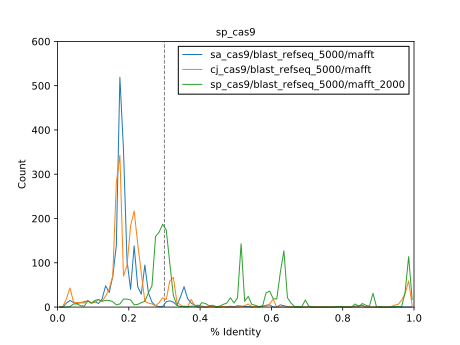
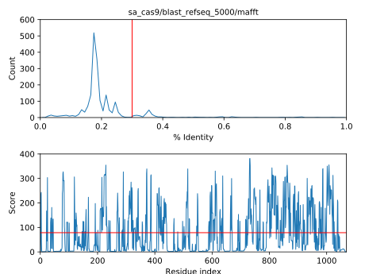
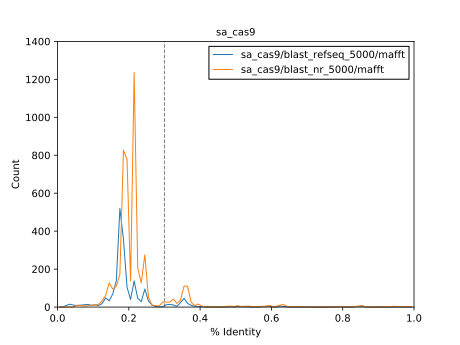
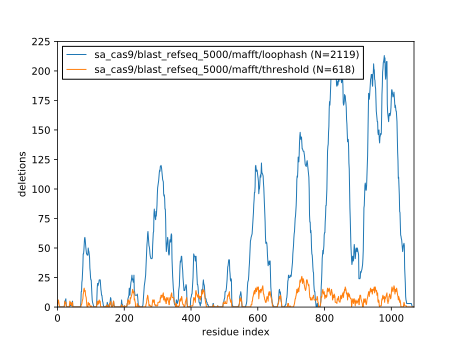
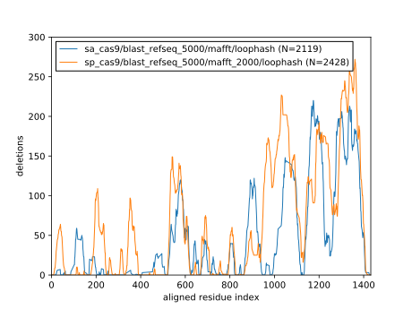
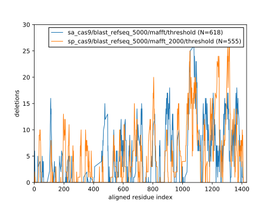

*************************
Pick deletions for saCas9
*************************

Staphylococcus aureus Cas9 (saCas9) is naturally shorter variant of spCas9, 
with only 1053 amino acids.  Given that our goal is to create the shortest 
possible Cas9, this may be a better starting point than spCas9.

Methods
=======
::

   $ minp 02 sa_cas9
   Found 1988 homologs.

::

   $ minp 03 sa_cas9/blast_refseq_5000
   SingleLetterAlphabet() alignment with 1988 rows and 1069 columns
   MKRNYILGLDIGITSVGYGIIDYETRDVIDAGVRLFKEANVENN...KKK SaCas9
   MKRNYILGLDIGITSVGYGIIDYETRDVIDAGVRLFKEANVENN...--- WP_081330634.1
   MKRHYILGLDIGITSVGYGIIDYETRDVIDAGVRLFKEANVENN...--- WP_096792116.1
   MNNSYILGLDIGITSVGYGIIDYETRDVIDAGVRLFKEANVENN...--- WP_107543406.1
   MNNSYILGLDIGITSVGYGIIDYETRDVIDAGVRLFKEANVENN...--- WP_105966910.1
   MNNSYILGLDIGITSVGYGIIDYETRDVIDAGVRLFKEANVENN...--- WP_105978400.1
   MNNSYILGLDIGITSVGYGIIEYETRDVIDAGVRLFKEANVENN...--- WP_105980293.1
   MNNSYILGLDIGITSVGYGIIEYETRDVIDAGVRLFKEANVENN...--- WP_096754380.1
   MNNSYILGLDIGITSVGYGIIDYETRDVIDAGVRLFKEANVENN...--- WP_083326835.1
   MNNSYILGLDIGITSVGYGIIDYETRDVIDAGVRLFKEANVENN...--- WP_119563783.1
   MNNSYILGLDIGITSVGYGIIDYETRDVIDAGVRLFKEANVENN...--- WP_107530431.1
   MNNSYILGLDIGITSVGYGIIDYETRDVIDAGVRLFKEANVENN...--- WP_119595339.1
   --------------------------------------------...--- WP_083310250.1
   MNRNYILGLDIGITSVGYGIIDYETRDVIDAGVRLFKEANVENN...--- WP_107596301.1
   MNNSYILGLDIGITSVGYGIIDYETRDVIDAGVRLFKEANVENN...--- WP_107568091.1
   --------------------------------------------...--- WP_103361957.1
   MNNSYILGLDIGITSVGYGIIDYETRDVIDAGVRLFKEANVENN...--- WP_107571611.1
   MVTKYILGLDIGITSVGYGIINYEDKTIIDAGVRLFPEANVENN...--- WP_107506206.1
   ...
   ----------MNQLPF-----SSNI----------I--------...--- WP_138930787.1
                                                                      
::

   $ minp 04/threshold sa_cas9/blast_refseq_5000/mafft
   Chose 618 deletions:

            del_start      del_end     del_len   del_score
   count   618.000000   618.000000  618.000000  618.000000
   mean    593.527508   602.550162    9.022654  183.468892
   std     299.595762   301.454150   14.287264   71.228559
   min       0.000000     4.000000    1.000000   78.765513
   25%     336.000000   343.000000    1.000000  125.157390
   50%     632.000000   639.500000    3.000000  173.796923
   75%     859.500000   869.000000    9.000000  236.104654
   max    1038.000000  1046.000000   94.000000  381.683817

::

   $ minp 04/loophash sa_cas9/blast_refseq_5000/mafft
   All possible residue pairs:          570846           (1069 residues)
   → Residue missing from pose:         543403   −27443  (26 missing residues; expect −27443)
   → No spanning loop found:            152828  −390575
   → Gap smaller than spanning loop:    146022    −6806
   → Spanning loop >6 residues:           8760  −137262
   → Deleted >10% of the protein:         6794    −1966
   → Below-average deletion score:        3816    −2978
   → Duplicates:                          2119    −1697

            del_start      del_end    del_score    gap_start      gap_end      len_gap  len_spanning_loop  len_deletion
   count  2119.000000  2119.000000  2119.000000  2119.000000  2119.000000  2119.000000        2119.000000   2119.000000
   mean    644.448325   671.057102   153.686784   640.702651   672.846126    32.143475           5.534697     26.608778
   std     281.229704   289.841551    58.541953   281.200873   289.782598    26.846269           0.576195     26.783050
   min      21.000000    23.000000    78.595556    17.700000    24.000000     4.000000           3.000000      1.000000
   25%     399.000000   409.500000   108.119635   392.000000   410.333333    10.708333           5.000000      5.000000
   50%     720.000000   755.000000   140.934144   714.000000   757.000000    22.000000           5.750000     16.000000
   75%     889.000000   903.000000   182.615585   887.500000   907.750000    46.500000           6.000000     41.000000
   max    1039.000000  1063.000000   381.332086  1039.000000  1068.000000   111.000000           6.000000    106.000000

Results
=======

Alignment quality
-----------------
saCas9 had a lower quality alignment than either spCas9 or cjCas9, despite the 
fact that BLAST found about the same number of sequences for saCas9 and cjCas9.

As with cjCas9, this in turn translates into fairly noisy deletion scores:

``nr`` database
---------------
Due to the relatively low number of BLAST hits for saCas9 relative to spCas9 in 
the ``refseq`` database, I decided to see if I could get more high-quality hits 
from the ``nr`` database:

I did get slightly more hits with >30% identity, but given the extra redundancy 
in the ``nr`` database, I decided to stick with ``refseq`` anyways.

Deletions
---------
As for spCas9 and cjCas9, the loophashs strategy produces about 4x more 
deletions than the threshold strategy:

The C-terminal deletions proposed by loophash agree pretty well between saCas9 
and spCas9.  This gives faith that the MSA is capturing real signal, even if 
it's not particularly high quality.  The N-terminal deletions don't agree as 
well.  Possibly that's just due to differences in the two proteins, but it may 
also be that the N-terminal predictions for saCas9 are not as accurate.

The threshold deletions are harder to judge, but they also agree better on the 
C-terminal side of the protein than on the N-terminal side.  Of course, both 
algorithms are using the same scores, so this makes sense:

