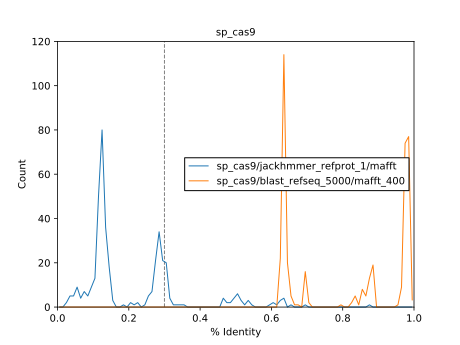
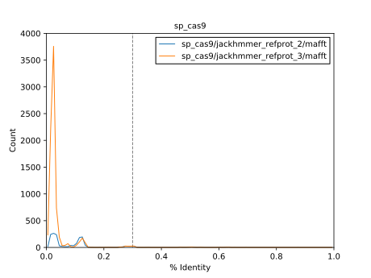

***************************
Find homologs via jackhmmer
***************************
On the advice of some speaker (I forget their name), I tried using jackhmmer to 
get greater sequence diversity.  My understanding is that jackhmmer is to hmmer 
as PSI-BLAST is to BLAST, although to be honest I didn't really look into how 
the algorithm works.

Method
======
1. Link query from a BLAST search directory.

2. Perform `jackhmmer` search on web server:

   https://www.ebi.ac.uk/Tools/hmmer/search/jackhmmer

3. Download full fasta results:

   https://www.ebi.ac.uk/Tools/hmmer/download/E4A40FEC-4CE2-11EA-9422-FBFBDBC3747A.2

   ::

      $ cd sp_cas9/jackhmmer_refprot_1
      $ curl -o homologs.fasta.gz https://www.ebi.ac.uk/Tools/hmmer/download/E4A40FEC-4CE2-11EA-9422-FBFBDBC3747A.1/score?format=fullfasta
      $ gunzip homologs.fasta.gz

4. Continue with the `minp` pipeline::

    $ minp 03 sp_cas9/jackhmmer_refprot_1

Results
=======
I did jackhmmer with 3 iterations.  I found that the results at each iteration 
were much worse than BLAST:

- A possible reason for the discrepancy is that I'm using different databases.  
  The jackhmmer web server is hosted by EMBL-EBI, and doesn't seem to use the 
  same NCBI databases as the BLAST web server.  The "Reference Proteomes" 
  (EMBL-EBI) database sounds similar to the "Refseq Protein" (NCBI) database, 
  but I couldn't find an exact description.  In any case, I don't really think 
  this is the problem.

- I should've done the jackhmmer search for cjCas9 or saCas9, since those 
  alignments are the ones that really need more sequences.  But these results 
  here weren't encouraging enough to pursue that avenue.
